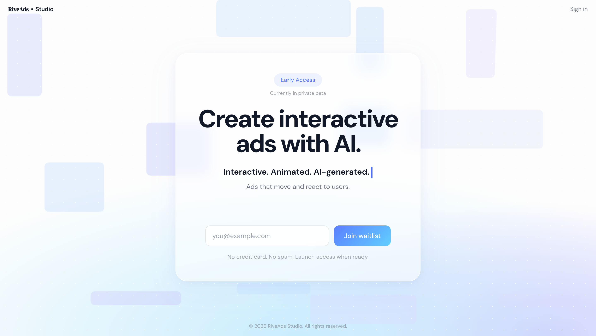
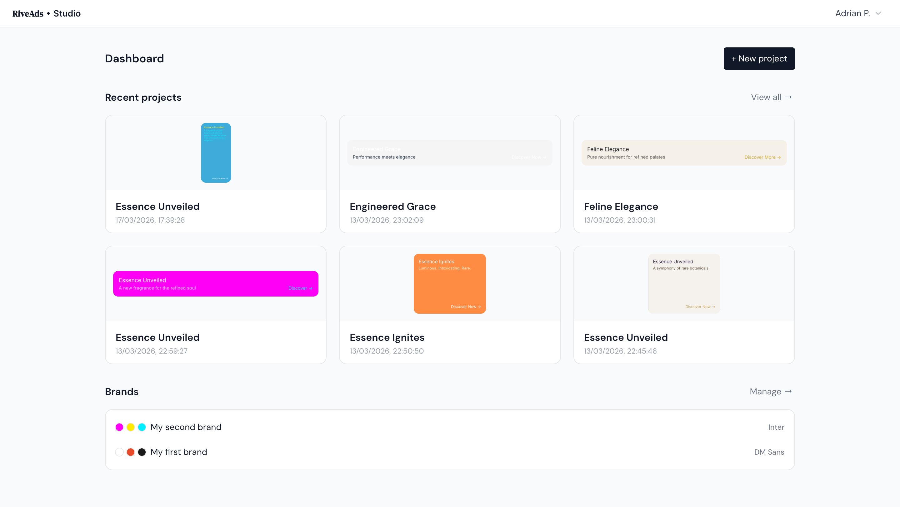
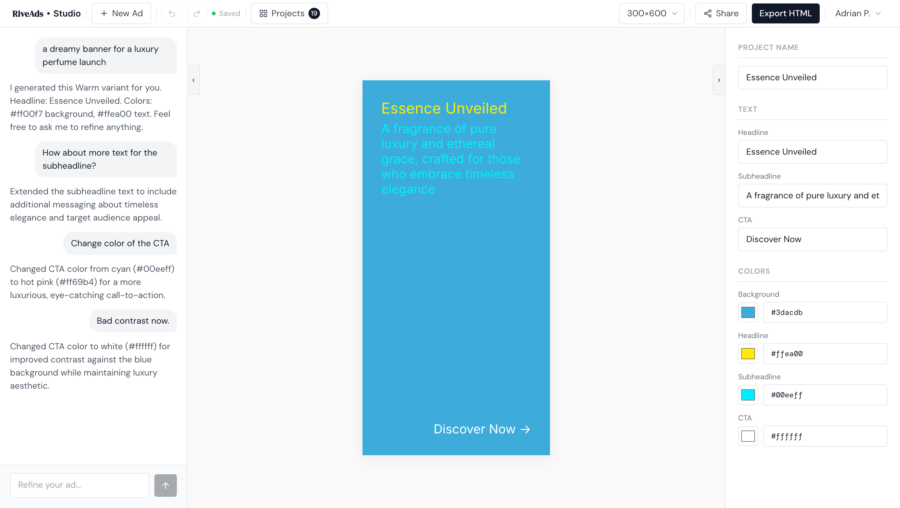
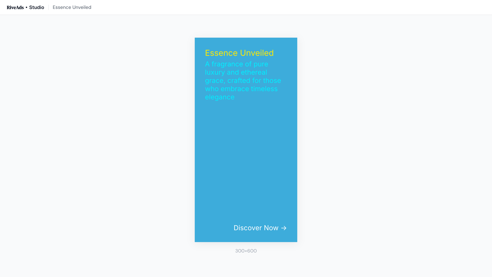
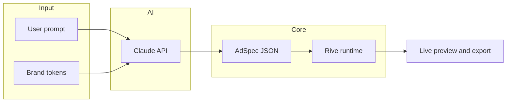

# RiveAds Studio

AI-assisted web app for generating **animated display ads** from natural language, rendered with the **Rive** runtime. A typed **AdSpec** schema drives layout, copy, and animation; outputs target embeddable HTML/JS, video, and static fallbacks (roadmap items where noted).

Experimental MVP — active development.

## Screenshots

Add PNG or WebP files under [`docs/`](docs/) using the names below (or swap paths in this README). Multiple views help show routing, auth, and the core editor.

| File | Suggested view |
|------|----------------|
| `docs/readme-landing.png` | Marketing / landing page |
| `docs/readme-projects.png` | Projects list or dashboard |
| `docs/readme-studio.png` | Main studio — chat, AdSpec, Rive canvas |
| `docs/readme-preview.png` | Public share preview (`/preview/…`) |

### Landing



### Projects



### Studio



### Share preview



---

## Highlights

- **Schema-first pipeline**: prompts and AI output conform to a strict TypeScript `AdSpec` contract, then apply to `.riv` templates.
- **Rive in the browser**: `@rive-app/canvas` / advanced APIs for text, state machines, and low-level styling.
- **Full-stack slice**: React 19 + Vite 7, Supabase (auth + data), Edge Functions for server-side concerns.
- **Product UX**: dashboard, projects, chat refinement, brand tokens, shareable previews, export paths.

---

## Live demo

[https://riveads.webz.ro/](https://riveads.webz.ro/)

---

## Tech stack

| Area | Choices |
|------|---------|
| UI | React 19, TypeScript, Tailwind CSS, React Router |
| Build | Vite 7 |
| Animation | Rive (`@rive-app/canvas`, `@rive-app/canvas-advanced`, `@rive-app/react-canvas`) |
| AI | Anthropic (Claude) — spec generation and refinement |
| Backend / auth | Supabase (client + Edge Functions) |

---

## Architecture



Narrative flow: **user prompt → Claude → AdSpec → Rive → preview / export**.

Design notes and product spec: [`public/docs/`](public/docs/) (including `design-spec.html`).

---

## Project layout

```
src/
  types/        # AdSpec schema — core data contract
  ai/           # Claude integration (spec + chat refinement)
  hooks/        # Rive renderer, ads, auth, brands, variants, …
  lib/          # riveApplier, templates, export helpers
  components/   # Canvas, chat, shell, modals
  pages/        # Landing, dashboard, auth, preview, …
public/
  templates/    # .riv assets (binary — edit in Rive Editor)
```

---

## Getting started

**Node:** 20+ recommended (`.nvmrc` pins 22 for parity with CI).

```bash
npm install
cp .env.example .env   # fill in Supabase + Anthropic keys for full functionality
npm run dev
```

| Script | Purpose |
|--------|---------|
| `npm run dev` | Local dev server |
| `npm run build` | Production build |
| `npm run preview` | Preview production build |
| `npm run lint` | ESLint |

---

## Rive templates

Templates are authored in the Rive editor with named slots:

- **Text runs**: `TEXT_HEADLINE`, `TEXT_SUBHEADLINE`, `TEXT_BODY`, `TEXT_CTA`, `TEXT_TAGLINE`
- **State machine inputs**: `speed` (number), `intensity` (number), `mood_*` (boolean)
- **Asset slots**: `IMAGE_LOGO`, `IMAGE_PRODUCT`, `IMAGE_BG`

`*.riv` files are binary; this repo uses `.gitattributes` for sensible diffs.

---

## Repo hygiene (for visitors)

- **GitHub**: Add a short repository description, website URL if deployed, and **topics** (e.g. `rive`, `react`, `typescript`, `vite`, `supabase`, `anthropic`, `generative-ai`).
- **License**: [MIT](LICENSE).
- **CI**: GitHub Actions runs a production `build` on push and pull requests. Run `npm run lint` locally when tightening code quality (some rules are still being aligned with the React 19 / Compiler setup).

---

## Notes

- Rive **Cadet** plan (paid) is required for certain template export workflows from the Rive editor.
